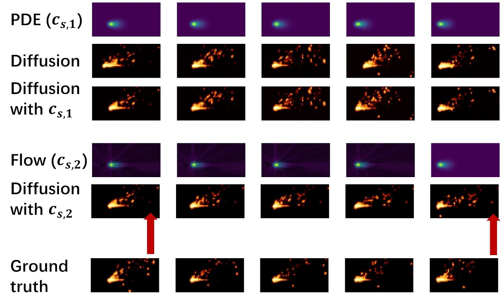
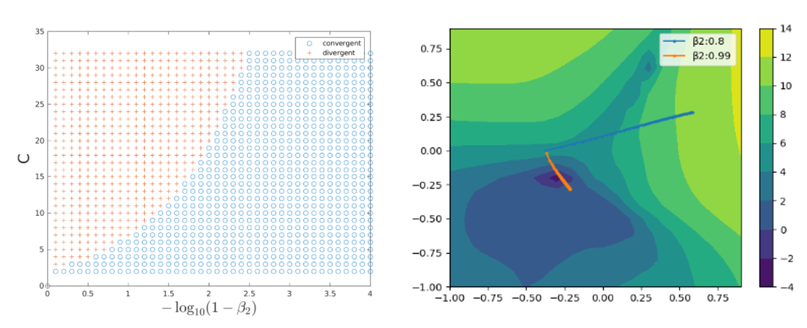

My research encompasses various facets of statistics and optimization. Below is a list of my publications. You are welcome to contact me if you are interested in one or more of my papers. I am happy to discuss!

## Preprints and paper in progress

[J9: In submission] <ins>**Multi-physics Simulation Guided Generative Diffusion Models with Applications in Fluid and Heat Dynamics**</ins>
Naichen Shi, Hao Yan, Shenghan Guo, Raed Kontar.
[Link](https://arxiv.org/abs/2407.17720), [Code](https://github.com/UMDataScienceLab/MGDM).

<smlt> Highlights</smlt>

<smlt>Diffusion generative models can generate photorealistic images and videos but often struggle to understand the physical interactions. When practitioners from the science and engineering fields have access to physics simulators, can they improve the quality of diffusion model-generated samples with the help of simulations?</smlt>

  

<smlt>We explore two strategies to incorporate physics simulation into diffusion models. Results show that our model indeed integrates physics knowledge in heat and fluid dynamics with patterns from real observations. </smlt>

 

[J8: In submission] <ins>**Heterogeneous Matrix Factorization: When Features Differ by Dataset**</ins>
Naichen Shi, Salar Fattahi, Raed Kontar.
[Link](https://arxiv.org/abs/2305.17744)

## Journal papers

[J7: JMLR] <ins>**Triple Component Matrix Factorization: Untangling Global, Local, and Noisy Components**</ins> 
Naichen Shi, Salar Fattahi, Raed Al Kontar. *Journal of Machine Learning Research (JMLR)*, 2024. [Link](https://jmlr.org/papers/v25/24-0400.html)

[J6: Technometrics] <ins>**Personalized Tucker Decomposition: Modeling Commonality and Peculiarity on Tensor Data**</ins> 
Jiuyun Hu, Naichen Shi, Raed Kontar, Hao Yan. *Technometrics*, 2024. [Link](https://arxiv.org/abs/2309.03439)

[J5: JMLR] <ins>**Personalized PCA: Decoupling Shared and Unique Features**</ins> 
Naichen Shi, Raed Al Kontar. *Journal of Machine Learning Research (JMLR)*, 2024. [Link](https://www.jmlr.org/papers/v25/22-0810.html), [Video](https://www.youtube.com/watch?v=9XWY745ZFPM), [Code](https://github.com/UMDataScienceLab/Personalized_PCA).

[J4: JMS] <ins>**Personalized feature extraction for manufacturing process signature characterization and anomaly detection**</ins> Naichen Shi, Shenghan Guo, Raed Al Kontar. *Journal of Manufacturing Systems*, 2024. [Link](https://www.sciencedirect.com/science/article/pii/S0278612524000694).

[J3: Technometrics] <ins>**Personalized Federated Learning via Domain Adaptation with an Application to Distributed 3D Printing**</ins> 
Naichen Shi, Raed Al Kontar. *Technometrics*, 2023. [Link](https://www.tandfonline.com/doi/abs/10.1080/00401706.2022.2157882?journalCode=utch20), [Video](https://www.youtube.com/watch?v=wOV8ZwdHgJ0), [Code](https://github.com/UMDataScienceLab/Personalized_FL_with_DA).

[J2: TASE] <ins>**Fed-ensemble: Ensemble Models in Federated Learning for Improved Generalization and Uncertainty Quantification**</ins> Naichen Shi, Raed Al Kontar. *IEEE Transactions on Automation Science and Engineering*, 2022. [Link](https://ieeexplore.ieee.org/document/10113748), [Code](https://github.com/UMDataScienceLab/fedensemble).

[J1: IEEE Access] <ins>**The Internet of Federated Things**</ins> Raed Kontar, Naichen Shi, Xubo Yue, Seokhyun Chung, Eunshin Byon, Mosharaf Chowdhury, Judy Jin, Wissam Kontar, Neda Masoud, Maher Noueihed, Chinedum E. Okwudire, Garvesh Raskutti, Romesh Saigal, Karandeep Singh, and Zhisheng Ye,  *IEEE Access*, 2021. [Link](https://ieeexplore.ieee.org/document/9611259).

## Conference papers

[C4: NeurIPS Spotlight] <ins>**Personalized Dictionary Learning for Heterogeneous Datasets**</ins> Geyu Liang, Naichen Shi, Raed Al Kontar, Salar Fattahi.  *Thirty-seventh Conference on Neural Information Processing Systems (NeurIPS)*, 2023. [Link](https://proceedings.neurips.cc/paper_files/paper/2023/hash/9f6f790f28a31fba89644f09faf4e0cb-Abstract-Conference.html), [Code](https://github.com/lianggeyuleo/PerMA). 

[C3: MSEC] <ins>**Process Signature Characterization and Anomaly Detection with Personalized PCA in Laser-Based Metal Additive Manufacturing** </ins> 
Naichen Shi, Raed Kontar, Shenghan Guo. *Proceedings of the ASME 2023 18th International Manufacturing Science and Engineering Conference*, 2022. [Link](https://asmedigitalcollection.asme.org/MSEC/proceedings-abstract/MSEC2023/1168823).

[C2: NeurIPS Spotlight] <ins>**Adam Can Converge Without Any Modification On Update Rules**</ins>
Yushun Zhang, Congliang Chen, Naichen Shi, Ruoyu Sun, Zhiquan Luo. *Thirty-sixth Conference on Neural Information Processing Systems (NeurIPS)*, 2022. [Link](https://proceedings.neurips.cc/paper_files/paper/2022/hash/b6260ae5566442da053e5ab5d691067a-Abstract-Conference.html). 

[C1: ICLR spotlight] <ins>**RMSprop converges with proper hyper-parameter**</ins>
Naichen Shi, Dawei Li, Mingyi Hong, and Ruoyu Sun. *International Conference on Learning Representations (ICLR)*, 2021. [Link](https://openreview.net/forum?id=3UDSdyIcBDA), [Video](https://iclr.cc/virtual/2021/spotlight/3415), [Code](https://github.com/soundsinteresting/RMSprop).

<smlt> Highlights</smlt>

<smlt>Almost every ML/AL practitioner uses adaptive stepsize optimization algorithms (e.g., Adam). Surprisingly, an important theoretical problem was largely unexplored: under what conditions can they converge? We show, both theoretically and numerically, that the good performance of RMSprop and Adam is contingent on the appropriate choice of the exponential averaging parameter $\beta_2$. Only when $\beta_2$ close enough to 1 can (stochastic versions of) Adam and RMSprop generate stable update directions that gradually lead the updates to the optimality. </smlt>

  

---

You can also check my [Google scholar profile](https://scholar.google.com/citations?user=9DVanY4AAAAJ&hl=en).

