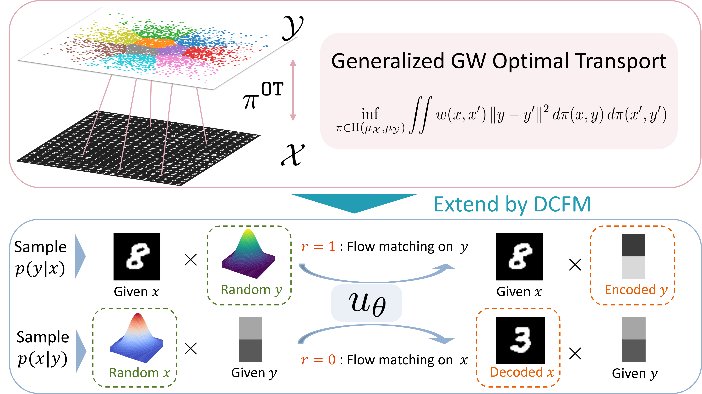
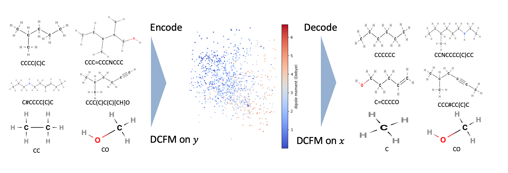
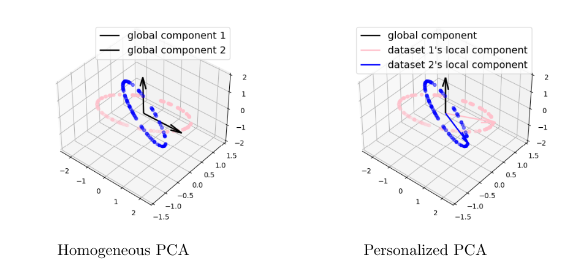
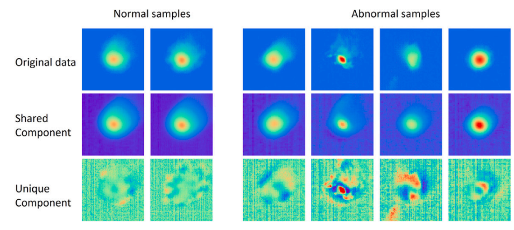
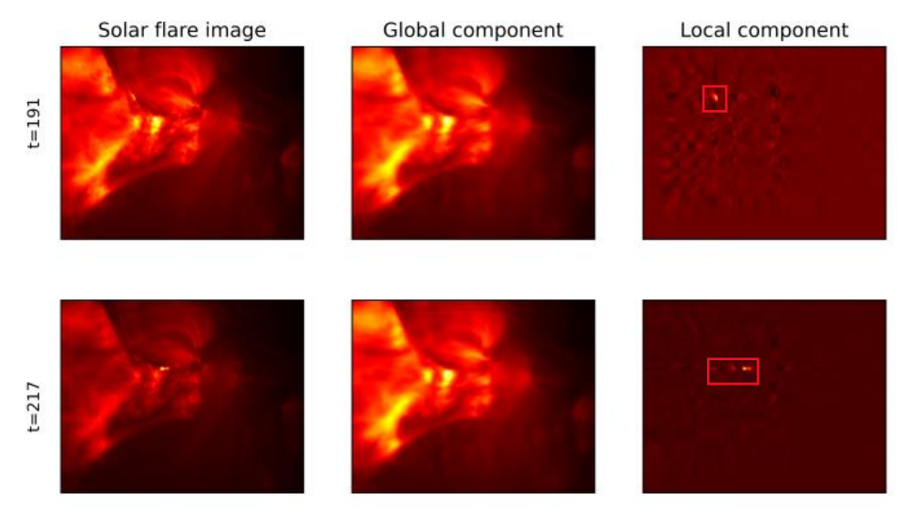

My research encompasses various facets of statistics and optimization. Below is a list of my publications. You are welcome to contact me if you are interested in one or more of my papers. I am happy to discuss!

Names of my students are <u>underlined</u>.

## Preprints and paper in progress

[In submission] <ins>**Coupled Flow Matching**</ins> 
Wenxi Cai, Yuheng Wang, Naichen Shi, 2025. [Link](https://arxiv.org/abs/2510.23015).

<smlt> Highlights</smlt>

<smlt>Many nonlinear dimension-reduction methods, such as EigenMaps, t-SNE, UMAP, and VAEs, map high-dimensional data into informative low-dimensional embeddings. But what if we want to explicitly control the distribution of these embeddings?</smlt>

  

<smlt>We develop a Coupled Flow Matching framework that unifies optimal transport and generative modeling. It consists of two components: an efficient solver for a generalized form of Gromov-Wasserstein optimal transport, and a dual conditional flow-matching network that learns bidirectional mappings between data and embeddings.
Together, they enable mapping complex, high-dimensional data into controllable low-dimensional representations, and generating realistic data samples from them.</smlt>

  

 

[In submission] <ins>**Domain Generalization: A Tale of Two ERMs**</ins>
Yilun Zhu, Naihao Deng, Naichen Shi, Aditya Gangrade, Clayton Scott.
[Link](https://www.arxiv.org/abs/2510.04441)

[In submission] <ins>**ALBATROSS: Cheap Filtration Based Geometry via Stochastic Sub-Sampling**</ins>
Andrew J Stier, Naichen Shi, Raed Al Kontar, Chad Giusti, Marc G Berman.
[Link](https://arxiv.org/abs/2509.03681)

[In submission] <ins>**Heterogeneous Matrix Factorization: When Features Differ by Dataset**</ins>
Naichen Shi, Salar Fattahi, Raed Kontar.
[Link](https://arxiv.org/abs/2305.17744)

## Journal papers

[IEEE T-ASE] <ins>**Diffusion-Based Surrogate Modeling and Multi-Fidelity Calibration**</ins>
Naichen Shi, Hao Yan, Shenghan Guo, Raed Kontar. *IEEE Transactions on Automation Science and Engineering*, 2025.
[Link](https://arxiv.org/abs/2407.17720), [Code](https://github.com/UMDataScienceLab/MGDM).

<smlt> Highlights</smlt>

<smlt>Diffusion generative models can generate photorealistic images and videos but often struggle to understand the physical interactions. When practitioners from the science and engineering fields have access to physics simulators, can they improve the quality of diffusion model-generated samples with the help of simulations?</smlt>

  

Here's a generated video.

  <video width="300" controls>
    <source src="../images/printsurface.mp4" type="video/mp4">
    Your browser does not support the video tag.
  </video>

<smlt>We explore two strategies to incorporate physics simulation into diffusion models. Results show that our model indeed integrates physics knowledge in heat and fluid dynamics with patterns from real observations. </smlt>

 

[JMLR] <ins>**Triple Component Matrix Factorization: Untangling Global, Local, and Noisy Components**</ins> 
Naichen Shi, Salar Fattahi, Raed Al Kontar. *Journal of Machine Learning Research (JMLR)*, 2024. [Link](https://jmlr.org/papers/v25/24-0400.html)

[Technometrics] <ins>**Personalized Tucker Decomposition: Modeling Commonality and Peculiarity on Tensor Data**</ins> 
Jiuyun Hu, Naichen Shi, Raed Kontar, Hao Yan. *Technometrics*, 2024. [Link](https://arxiv.org/abs/2309.03439)

[JMLR] <ins>**Personalized PCA: Decoupling Shared and Unique Features**</ins> 
Naichen Shi, Raed Al Kontar. *Journal of Machine Learning Research (JMLR)*, 2024. [Link](https://www.jmlr.org/papers/v25/22-0810.html), [Video](https://www.youtube.com/watch?v=9XWY745ZFPM), [Code](https://github.com/UMDataScienceLab/Personalized_PCA).

<smlt> Highlights</smlt>

 When data are collected from multiple related but heterogeneous sources, how can we efficiently integrate the common information among these sources? How to describe and make use of the unique feature in each source? We take advantage of the feature extraction power of principal component analysis (PCA). More specifically, we use global principal components (PCs) to model the common information and local principal components to capture the unique information.  

  

 <b>Identifiability</b> is a key hurdle as the global PCs can be confounded with local PCs in data. We propose a <i>misalignment condition</i> that measures the "smallest difference" among the subspaces spanned by global PCs. The condition helps us establish an upper bound on the statistical error of the global and local PCs, which almost matches their lower bound. Intriguingly, the results suggest that a higher level of heterogeneity can decrease the statistical error in our method, a benefit of personalization.  

 Despite the simplicity, Personalized PCA and its derivatives have proven valuable in a variety of fields, including  <a href="https://www.sciencedirect.com/science/article/abs/pii/S0278612524000694"><b>additive manufacturing</b></a>, <a href="https://arxiv.org/pdf/2309.03439"><b>solar flare detection</b></a>.

  
  

 An article from <a href="https://phys.org/news/2024-03-statistical-tool-distinguish-unique-features.html">Phys.org</a> reports this method. 

 

[JMS] <ins>**Personalized feature extraction for manufacturing process signature characterization and anomaly detection**</ins> Naichen Shi, Shenghan Guo, Raed Al Kontar. *Journal of Manufacturing Systems*, 2024. [Link](https://www.sciencedirect.com/science/article/pii/S0278612524000694).

[Technometrics] <ins>**Personalized Federated Learning via Domain Adaptation with an Application to Distributed 3D Printing**</ins> 
Naichen Shi, Raed Al Kontar. *Technometrics*, 2023. [Link](https://www.tandfonline.com/doi/abs/10.1080/00401706.2022.2157882?journalCode=utch20), [Video](https://www.youtube.com/watch?v=wOV8ZwdHgJ0), [Code](https://github.com/UMDataScienceLab/Personalized_FL_with_DA).

[IEEE T-ASE] <ins>**Fed-ensemble: Ensemble Models in Federated Learning for Improved Generalization and Uncertainty Quantification**</ins> Naichen Shi, Raed Al Kontar. *IEEE Transactions on Automation Science and Engineering*, 2022. [Link](https://ieeexplore.ieee.org/document/10113748), [Code](https://github.com/UMDataScienceLab/fedensemble).

[IEEE Access] <ins>**The Internet of Federated Things**</ins> Raed Kontar, Naichen Shi, Xubo Yue, Seokhyun Chung, Eunshin Byon, Mosharaf Chowdhury, Judy Jin, Wissam Kontar, Neda Masoud, Maher Noueihed, Chinedum E. Okwudire, Garvesh Raskutti, Romesh Saigal, Karandeep Singh, and Zhisheng Ye,  *IEEE Access*, 2021. [Link](https://ieeexplore.ieee.org/document/9611259).

## Conference papers
[AISTATS] <ins>**Calibrated Principal Component Regression**</ins>
<u>Yixuan Florence Wu</u>, Yilun Zhu, <u>Lei Cao</u>, Naichen Shi. *Twenty-Ninth Annual Conference on Artificial Intelligence and Statistics (AISTATS)*, 2026. [Link](https://arxiv.org/abs/2510.19020)

[NeurIPS] <ins>**Inv-Entropy: A Fully Probabilistic Framework for Uncertainty Quantification in Language Models**</ins>
Haoyi Song, Ruihan Ji, Naichen Shi, Fan Lai, Raed Al Kontar. *The Thirty-ninth Annual Conference on Neural Information Processing Systems (NeurIPS)*, 2025.
[Link](https://arxiv.org/abs/2506.09684)

[NeurIPS Spotlight] <ins>**Personalized Dictionary Learning for Heterogeneous Datasets**</ins> Geyu Liang, Naichen Shi, Raed Al Kontar, Salar Fattahi.  *Thirty-seventh Conference on Neural Information Processing Systems (NeurIPS)*, 2023. [Link](https://proceedings.neurips.cc/paper_files/paper/2023/hash/9f6f790f28a31fba89644f09faf4e0cb-Abstract-Conference.html), [Code](https://github.com/lianggeyuleo/PerMA). 

[MSEC] <ins>**Process Signature Characterization and Anomaly Detection with Personalized PCA in Laser-Based Metal Additive Manufacturing** </ins> 
Naichen Shi, Raed Kontar, Shenghan Guo. *Proceedings of the ASME 2023 18th International Manufacturing Science and Engineering Conference*, 2022. [Link](https://asmedigitalcollection.asme.org/MSEC/proceedings-abstract/MSEC2023/1168823).

[NeurIPS Spotlight] <ins>**Adam Can Converge Without Any Modification On Update Rules**</ins>
Yushun Zhang, Congliang Chen, Naichen Shi, Ruoyu Sun, Zhiquan Luo. *Thirty-sixth Conference on Neural Information Processing Systems (NeurIPS)*, 2022. [Link](https://proceedings.neurips.cc/paper_files/paper/2022/hash/b6260ae5566442da053e5ab5d691067a-Abstract-Conference.html). 

[ICLR spotlight] <ins>**RMSprop converges with proper hyper-parameter**</ins>
Naichen Shi, Dawei Li, Mingyi Hong, and Ruoyu Sun. *International Conference on Learning Representations (ICLR)*, 2021. [Link](https://openreview.net/forum?id=3UDSdyIcBDA), [Video](https://iclr.cc/virtual/2021/spotlight/3415), [Code](https://github.com/soundsinteresting/RMSprop).

<smlt> Highlights</smlt>

<smlt>Almost every ML/AL practitioner uses adaptive stepsize optimization algorithms (e.g., Adam). Surprisingly, an important theoretical problem was largely unexplored: under what conditions can they converge? We show, both theoretically and numerically, that the good performance of RMSprop and Adam is contingent on the appropriate choice of the exponential averaging parameter $\beta_2$. Only when $\beta_2$ close enough to 1 can (stochastic versions of) Adam and RMSprop generate stable update directions that gradually lead the updates to the optimality. </smlt>

  

---

You can also check my [Google scholar profile](https://scholar.google.com/citations?user=9DVanY4AAAAJ&hl=en).

